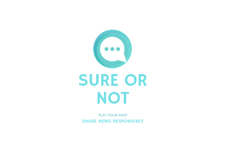
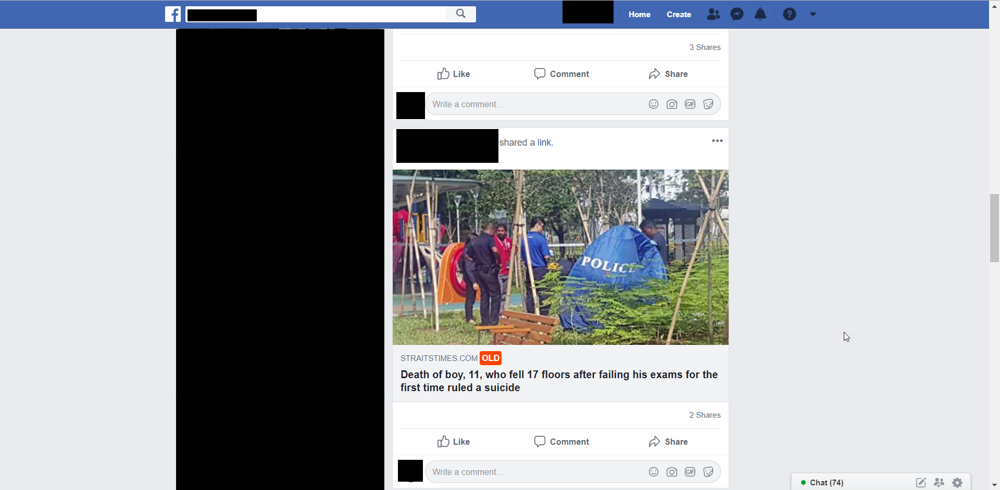

# Sure Or Not
SureOrNot - A chrome extension for your Facebook feed to fight fake news

How often do you ask yourself **"Sure Or Not?"** whenever you chance upon a controversial heartstirring news? [SureOrNot](https://chrome.google.com/webstore/detail/sure-or-not-news-date-val/hkiapjaidokhcajjnpldhioambcjbbhp) provides users with a heads up if you are reading an outdated or uncredible news article on your Facebook feed to fight Fake News. Sometimes outdated news are often shared again due to the controversy it brings or to create tensions.

## Objectives of SureOrNot

To empower social media users to with analytical capabilities and aid them to distinguish real news from misinformation.

## Getting Started

Before we start, if this is the first time you are developing chrome extensions, take a look at the [tutorial](https://developer.chrome.com/extensions/getstarted) from Google. Ensure that you have enabled developer mode, familiarise with the basics of chrome extensions and know how to load them into your browser.

## Running the tests

Debugging can be a little tricky for chrome extensions, personally I add in 'console.log(...)' and output will be displayed in Chrome DevTools (Press F12 on your Chrome browser). Fortunately for this project, there is only one script (content.js) to work on.

## Deployment

Once you're done with development, do submit a pull request and I'll update the [Chrome WebStore](https://chrome.google.com/webstore/detail/sure-or-not-news-date-val/hkiapjaidokhcajjnpldhioambcjbbhp).

## Contributing

Please read [CONTRIBUTING.md](https://gist.github.com/PurpleBooth/b24679402957c63ec426) for details on our code of conduct, and the process for submitting pull requests to us.

## Current Plans
These are the features planned, feel free to suggest improvements
- [x] Determine if a news is outdated by at least more than 6 months
- [ ] Determine if a news is emotional
- [ ] Determine if a news is from a trusted source
- [ ] Determine if the credibility or fake news score of a news

## License

This project is licensed under the MIT License - see the [LICENSE.md](LICENSE.md) file for details

## Acknowledgments

* Dennis for his amazing JS expertise
